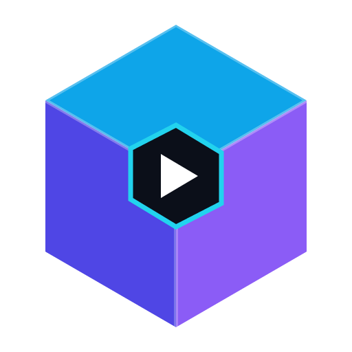
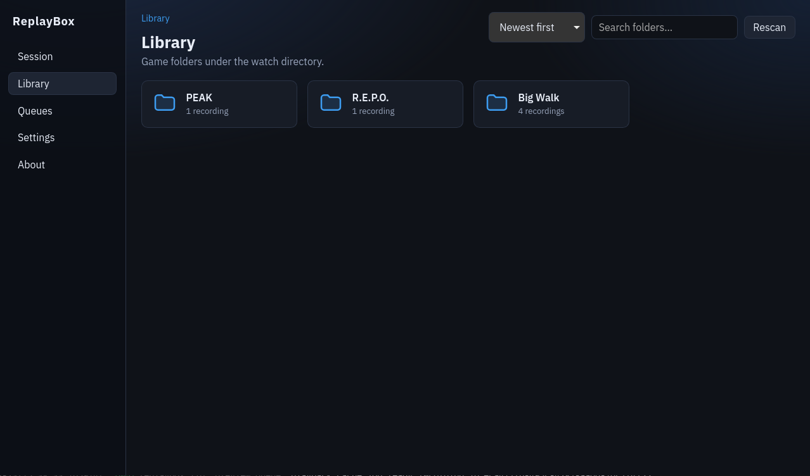
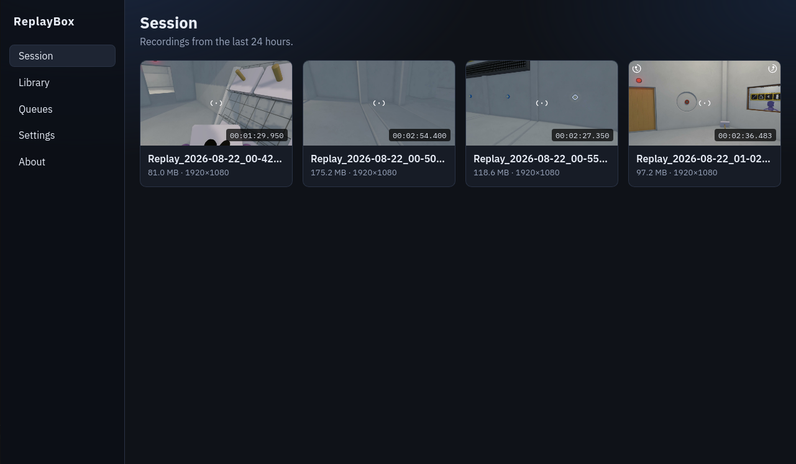
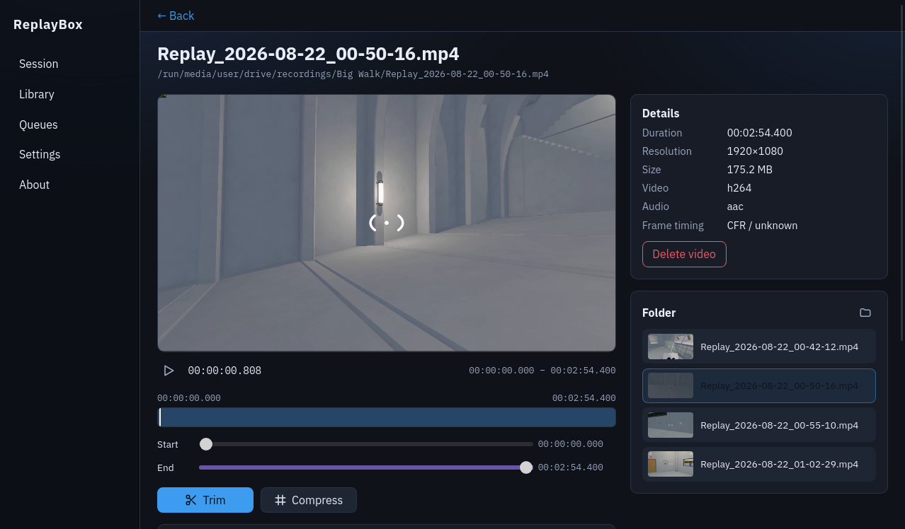

<p align="center">
  
</p>

# ReplayBox

**Clip companion for game recordings**

---

ReplayBox helps you turn long game recordings into shareable clips. Browse your recordings folder, review your recorded clips, trim and compress, then export a copy ready to upload or send.

---

## Screenshots

| Library | Session | Editor |
| --- | --- | --- |
|  |  |  |

## Features

- **Game folders** — browse recordings by game under your watch directory
- **Last 24 hours** — review recent captures
- **Instant trim** — stream copy via FFmpeg; may snap to keyframes at cut points
- **Compress** — smaller files for uploads


## Build

Host packages, FFmpeg bundling, and troubleshooting: **[docs/BUILD.md](docs/BUILD.md)**.

```bash
npm install
npm run tauri:dev      # FFmpeg + hot reload
npm run build:all      # full production build (or ./scripts/build-all.sh)
```


| Binary      | Role                                        |
| ----------- | ------------------------------------------- |
| `replaybox` | Desktop app (`default-run` for `cargo run`) |


## First run

1. Open **Settings** and confirm the **watch folder**.
2. (Optional) Enable **Start ReplayBox in the tray when you log in**, then Save.
3. Use **Library** or **Session** (last 24 hours) to browse recordings.
4. Open a clip to trim or compress (**create a copy** or replace the original).
5. Closing the window hides to the tray, use **Quit** in the tray menu to exit.


## Logs

Backend logs are written daily to `~/.local/share/org.replaybox/logs/replaybox.log.YYYY-MM-DD` (at most 7 days retained). Config, database, and cache use separate XDG folders. See **[docs/BUILD.md — Logging](docs/BUILD.md#logging)** for all paths and how to change verbosity with `RUST_LOG`.

## Stack

Tauri 2 · React / TypeScript · FFmpeg · SQLite — **Linux**

## License

ReplayBox is licensed under the [MIT License](LICENSE).

The distributed AppImage also bundles **FFmpeg** (GPL-2.0, with **libx264**) and **GStreamer / WebKitGTK / GTK** (LGPL-2.1). See [THIRD_PARTY.md](THIRD_PARTY.md) and [docs/BUILD.md](docs/BUILD.md) before redistributing.
